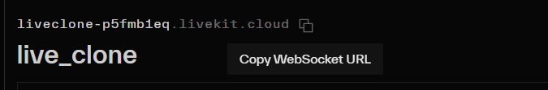

vào likekit.io => create project ở bên cái try livekit => tạo project mới

tạo xong ấn sang settings => keys => add new key => gõ development => generate => ra 3 cái trong có 2 cái key (api key và api sercet)

thêm vào env

```ts
LIVEKIT_API_KEY = APIB5mpV3fjxsDR;
LIVEKIT_API_SECRET = lrOe3f6axDKHF6KAZqqFatEq7Oeh0xARJV5WYDJ5CxIB;
```

còn 1 cái WebSocket URL ch cần dùng

- tìm thêm cái này nữa LIVEKIT_API_URL
  vào cái Analytics => thấy 1 đoạn mã ở trên đầu (bên trên cái tên project)


đây là cái LIVEKIT_API_URL

- còn 1 cái nữa NEXT_PUBLIC_LIVEKIT_WA_URL=wss://liveclone-p5fmb1eq.livekit.cloud
  lấy ở đâu => vào key ấn vào cái key vừa tạo => có cái WebSocket URL => copy dán vào

```ts
LIVEKIT_API_URL=https://liveclone-p5fmb1eq.livekit.cloud
LIVEKIT_API_KEY=APIB5mpV3fjxsDR
LIVEKIT_API_SECRET=lrOe3f6axDKHF6KAZqqFatEq7Oeh0xARJV5WYDJ5CxIB
NEXT_PUBLIC_LIVEKIT_WS_URL=wss://liveclone-p5fmb1eq.livekit.cloud
```

cài đặt thư viện

npm i @livekit/components-react

npm i livekit-client livekit-server-sdk

viết file `actions/ingress.ts`

```ts
"use server";

import {
  IngressAudioEncodingPreset,
  IngressInput,
  IngressClient,
  IngressVideoEncodingPreset,
  RoomServiceClient,
  type CreateIngressOptions,
  TrackSource,
  IngressVideoOptions,
  IngressAudioOptions,
} from "livekit-server-sdk";
import { db } from "@/lib/db";
import { getSeft } from "@/lib/auth-service";
import { revalidatePath } from "next/cache";
const roomService = new RoomServiceClient(
  process.env.LIVEKIT_API_URL!,
  process.env.LIVEKIT_API_KEY!,
  process.env.LIVEKIT_API_SECRET!
);
const ingressClient = new IngressClient(process.env.LIVEKIT_API_URL!);

export const resetIngress = async (hostIdentity: string) => {
  const ingresses = await ingressClient.listIngress({
    roomName: hostIdentity,
  });
  const rooms = await roomService.listRooms([hostIdentity]);
  for (const room of rooms) {
    await roomService.deleteRoom(room.name);
  }
  for (const ingress of ingresses) {
    if (ingress.ingressId) {
      await ingressClient.deleteIngress(ingress.ingressId);
    }
  }
};

export const createIngress = async (ingressType: IngressInput) => {
  const self = await getSeft();
  await resetIngress(self.id);
  const options: CreateIngressOptions = {
    name: self.username,
    roomName: self.id,
    participantName: self.username,
    participantIdentity: self.id,
  };
  if (ingressType === IngressInput.WHIP_INPUT) {
    options.bypassTranscoding = true;
  } else {
    options.video = new IngressVideoOptions({
      source: TrackSource.CAMERA,
      encodingOptions: {
        case: "preset",
        value: IngressVideoEncodingPreset.H264_1080P_30FPS_3_LAYERS,
      },
    });
    options.audio = new IngressAudioOptions({
      source: TrackSource.MICROPHONE,
      encodingOptions: {
        case: "preset",
        value: IngressAudioEncodingPreset.OPUS_STEREO_96KBPS,
      },
    });
  }
  const ingress = await ingressClient.createIngress(ingressType, options);
  if (!ingress || !ingress.url || !ingress.streamKey) {
    throw new Error("Failed to create ingress");
  }
  await db.stream.update({
    where: {
      userId: self.id,
    },
    data: {
      ingressId: ingress.ingressId,
      serverUrl: ingress.url,
      streamKey: ingress.streamKey,
    },
  });
  revalidatePath(`/u/${self.username}/keys`);
  // return ingress;
  return {
    ingressId: ingress.ingressId,
    url: ingress.url,
    streamKey: ingress.streamKey,
  };
};
```

sử dụng bên cái `connectModal.tsx`

```ts
"use client";
import { Button } from "@/components/ui/button";
import { IngressInput } from "livekit-server-sdk";
import {
  Dialog,
  DialogContent,
  DialogClose,
  DialogHeader,
  DialogTitle,
  DialogTrigger,
} from "@/components/ui/dialog";
import {
  Select,
  SelectContent,
  SelectItem,
  SelectTrigger,
  SelectValue,
} from "@/components/ui/select";
import { Alert, AlertDescription, AlertTitle } from "@/components/ui/alert";
import { AlertTriangle } from "lucide-react";
import { useState, useTransition, useRef, ElementRef } from "react";
import { createIngress } from "@/actions/ingress";
import { toast } from "sonner";
const RTMP = String(IngressInput.RTMP_INPUT);
const WHIP = String(IngressInput.WHIP_INPUT);
type IngressType = typeof RTMP | typeof WHIP;

const ConnectModal = () => {
  const closeRef = useRef<ElementRef<"button">>(null);
  const [isPending, startTransition] = useTransition();
  const [ingressType, setIngressType] = useState<IngressType>(RTMP);

  const onSubmit = () => {
    startTransition(() => {
      createIngress(parseInt(ingressType))
        .then((data) => {
          toast.success("Ingress created");
          closeRef.current?.click();
        })
        .catch((error) => {
          console.log("errorrrrrr", error);
          toast.error("Something went wrong");
        });
    });
  };
  return (
    <Dialog>
      <DialogTrigger asChild>
        <Button variant={"primary"}>Generate connection</Button>
      </DialogTrigger>
      <DialogContent>
        <DialogHeader>
          <DialogTitle>Generate connection</DialogTitle>
        </DialogHeader>
        <Select
          disabled={isPending}
          value={ingressType}
          onValueChange={(value) => setIngressType(value as IngressType)}
        >
          <SelectTrigger className="w-full">
            <SelectValue placeholder="Ingress Type" />
          </SelectTrigger>
          <SelectContent>
            <SelectItem value={RTMP}>RTMP</SelectItem>
            <SelectItem value={WHIP}>WHIP</SelectItem>
          </SelectContent>
        </Select>
        <Alert>
          <AlertTriangle className="h-4 w-4 !text-white" />
          <AlertTitle>Warning</AlertTitle>
          <AlertDescription>
            This action will reset all active streams using the current
            connection
          </AlertDescription>
        </Alert>
        <div className="flex justify-between">
          <DialogClose ref={closeRef} asChild>
            <Button variant={"ghost"}>Cancel</Button>
          </DialogClose>
          <Button disabled={isPending} onClick={onSubmit} variant={"primary"}>
            Generate
          </Button>
        </div>
      </DialogContent>
    </Dialog>
  );
};

export default ConnectModal;
```

# OBS crash course

copy cái server url bên cái màn generate code => dán vào tabs bên obs (setting => stream => server)

# livekit webhook

chạy lên bằng `ngrok` => vào ổ D => ngrok => chạy cái exe của nó lên =>
`ngrok http --domain=positive-moth-infinite.ngrok-free.app 3000` chạy lệnh này

vào livekit.io => try => setting => webhooks => add new endpint

điền `name:development`

url : là cái url đang chạy thực tế `https://positive-moth-infinite.ngrok-free.app/api/webhooks/livekit`

=> create

vào code tạo file `D:\00_nextJs\project\live\app\api\webhooks\livekit\route.ts`

```ts
import { headers } from "next/headers";
import { WebhookReceiver } from "livekit-server-sdk";
import { db } from "@/lib/db";
import { NextResponse } from "next/server";
const receiver = new WebhookReceiver(
  process.env.LIVEKIT_API_KEY!,
  process.env.LIVEKIT_API_SECRET!
);
export async function POST(req: Request) {
  const body = await req.text();
  const headerPayload = headers();
  const authorization = headerPayload.get("Authorization");
  if (!authorization) {
    return new Response("No authorization header", { status: 400 });
  }
  const event = receiver.receive(body, authorization);
  if ((await event).event === "ingress_started") {
    await db.stream.update({
      where: {
        ingressId: (await event).ingressInfo?.ingressId,
      },
      data: {
        isLive: true,
      },
    });
  }
  if ((await event).event === "ingress_ended") {
    await db.stream.update({
      where: {
        ingressId: (await event).ingressInfo?.ingressId,
      },
      data: {
        isLive: false,
      },
    });
  }
  return NextResponse.json({ message: "Webhook received" }, { status: 200 });
}
```

khi dó ng A stream thì cái icon của ng A sẽ là cái đang live

# video component
